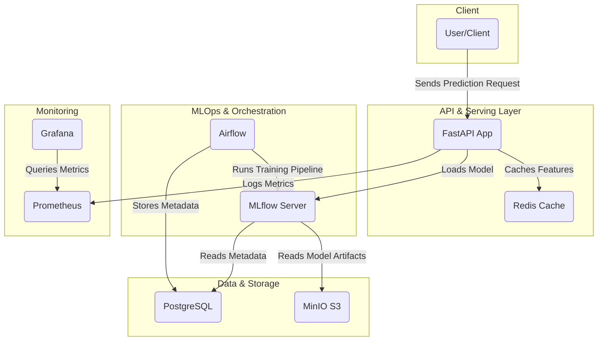
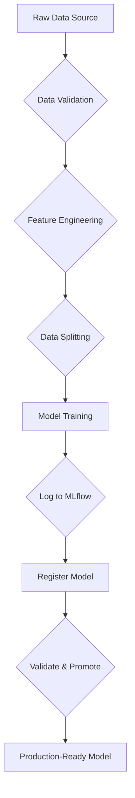
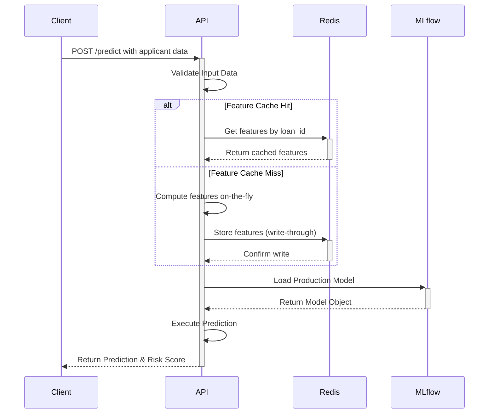

# System Architecture

This document provides a comprehensive overview of the architecture for the Alternative Credit Scoring platform. The system is designed with a modular, scalable, and MLOps-centric philosophy, ensuring that it is not only performant but also maintainable and extensible.

## 1. System Components

The platform is a multi-container system composed of several specialized services that work together. The diagram below illustrates the high-level component architecture.



### Component Descriptions

-   **FastAPI App (API):** The primary entry point for all client interactions. It handles HTTP requests, validates input data using Pydantic, serves predictions, and exposes endpoints for health checks and monitoring. It contains the Champion-Challenger logic for routing traffic between different model versions.

-   **Redis:** An in-memory data store used as a low-latency feature cache. It helps to reduce prediction latency by storing pre-computed features and avoids redundant computations for frequently accessed data.

-   **MLflow Server:** The core of the MLOps workflow. It serves two main purposes:
    -   **Experiment Tracking:** Logs parameters, metrics, and artifacts from model training runs.
    -   **Model Registry:** Manages the lifecycle of ML models, including versioning and stage transitions (e.g., from `Staging` to `Production`).

-   **PostgreSQL:** A robust relational database that acts as the backend store for both MLflow and Airflow, persisting all metadata for experiments, model versions, and pipeline runs.

-   **MinIO:** An S3-compatible object storage service. It is used as MLflow's artifact store, holding large files such as trained model binaries, plots, and large datasets.

-   **Apache Airflow:** The workflow orchestration engine. It is used to define, schedule, and monitor the batch model training pipelines as Directed Acyclic Graphs (DAGs).

-   **Prometheus & Grafana:** The observability stack. Prometheus scrapes and stores time-series metrics from the API (e.g., request latency, error rates, prediction counts), while Grafana provides a powerful interface for visualizing these metrics in dashboards.

---

## 2. Technology Stack

| Category              | Technology       | Role & Justification                                           |
| --------------------- | ---------------- | -------------------------------------------------------------- |
| **Backend Framework**   | FastAPI          | High-performance Python framework for building RESTful APIs.     |
| **ML Frameworks**       | XGBoost, Scikit-learn | State-of-the-art libraries for model training and data processing. |
| **MLOps Platform**      | MLflow           | Manages the end-to-end ML lifecycle, from tracking to registry.  |
| **Orchestration**     | Apache Airflow   | Automates and schedules the model retraining pipelines.          |
| **Feature Caching**     | Redis            | In-memory cache for fast access to pre-computed features.      |
| **Database**            | PostgreSQL       | Reliable metadata storage for MLflow and Airflow.              |
| **Artifact Store**      | MinIO            | S3-compatible storage for model artifacts.                     |
| **Containerization**    | Docker           | Ensures consistent environments from development to production.  |
| **Local Orchestration** | Docker Compose   | Defines and runs the local multi-container application stack.  |
| **Monitoring**          | Prometheus, Grafana | Industry-standard stack for metrics collection and visualization. |
| **Drift Detection**     | Evidently AI     | Monitors for data and prediction drift in production.          |

---

## 3. Data Flow

There are two primary data flows in the system: the offline training flow and the online inference flow.

### Model Training Flow (Offline)

This flow describes how a model is trained and registered for production use. It is typically executed as an Airflow DAG.



1.  **Ingestion & Validation:** Raw data is loaded and validated against a predefined schema.
2.  **Feature Engineering:** The validated data is transformed into features suitable for the model.
3.  **Training & Logging:** The model is trained on the feature set, and all results (metrics, parameters, artifacts) are logged to the MLflow Tracking Server.
4.  **Registration & Promotion:** The trained model is registered in the MLflow Model Registry. After passing validation tests, it is promoted to the "Production" stage, making it available to the API.

### Prediction Flow (Online)

This flow describes how a live prediction request is handled by the API.



1.  **Request:** A client sends a JSON request to the `/predict` endpoint.
2.  **Validation:** The API validates the request body against its Pydantic model.
3.  **Feature Retrieval:** The API first attempts to fetch pre-computed features from the Redis cache. If not found, it computes them in real-time and caches the result.
4.  **Model Loading:** The API loads the production model from the MLflow registry (caching it in memory after the first load).
5.  **Inference:** The model generates a prediction.
6.  **Response:** The API formats the prediction into a JSON response and sends it back to the client.

---

## 4. Repository Structure

The repository is organized to separate concerns, making it easy to navigate and maintain.

```
.
├── .github/          # CI/CD workflows (GitHub Actions)
├── configs/          # Project configuration files
├── dags/             # Airflow DAG definitions
├── data/             # Datasets (raw, processed, reference)
├── docs/             # Project documentation
├── notebooks/        # Jupyter notebooks for EDA and prototyping
├── src/              # Main Python source code
│   ├── api/          # FastAPI application
│   ├── data/         # Data cleaning and feature engineering
│   ├── models/       # Model training and evaluation scripts
│   └── monitoring/   # Drift detection and monitoring code
├── tests/            # Automated tests
├── docker-compose.yml # Local development environment definition
└── README.md         # Project entry point
```
