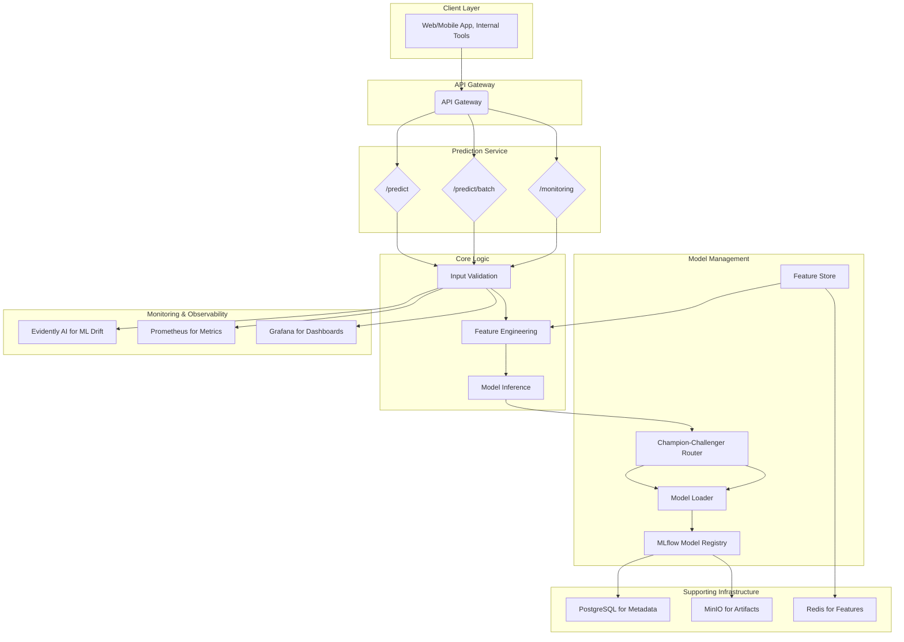

# System Architecture Overview

The system is designed with a layered architecture to ensure scalability, maintainability, and clear separation of concerns. It follows modern MLOps practices, integrating model development, deployment, and monitoring into a cohesive whole.

### High-Level Design

The architecture can be visualized as a series of layers, from the client-facing API down to the supporting infrastructure and monitoring stacks.

### Key Architectural Layers

1.  **Client Layer:** Any application (web, mobile, internal tool) that consumes the credit scoring service.
2.  **API Gateway:** The single entry point for all client requests. It is responsible for handling cross-cutting concerns like authentication, rate limiting, and request routing.
3.  **Prediction Service Layer:** The core of the application, responsible for handling prediction logic. It includes endpoints for real-time single predictions, batch predictions, and monitoring.
4.  **Core Logic:** Within the prediction service, a pipeline validates input, performs feature engineering (potentially interacting with a feature store), and executes model inference.
5.  **Model Management:** This layer is responsible for serving the correct model version. It uses a Champion-Challenger pattern to safely route traffic to new models and loads models directly from the MLflow Model Registry.
6.  **Supporting Infrastructure:** The foundational persistence layer, including a PostgreSQL database for MLflow metadata, a MinIO S3-compatible object store for model artifacts, and a Redis instance for the feature store cache.
7.  **Monitoring & Observability:** A parallel stack that provides insights into the system's health and performance. It includes specialized ML monitoring for data drift, infrastructure metrics, and visualization dashboards.
