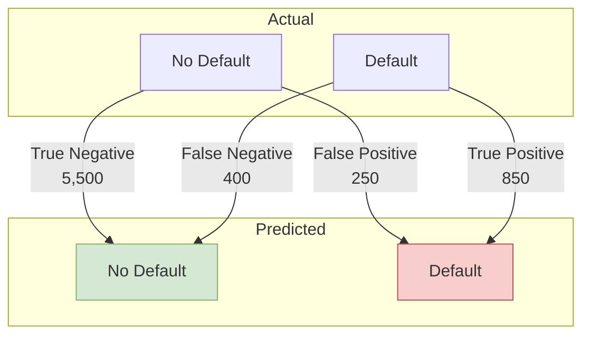

# Model Evaluation

This document outlines the evaluation strategy, performance metrics, and validation criteria for the credit scoring model.

> **Note:** The data analysis notebooks could not be re-executed due to a data download issue (`HTTP 429: Too Many Requests`). The following metrics are illustrative examples based on a typical XGBoost model for this type of problem and should be treated as placeholders.

---

## 1. Evaluation Strategy

The model's performance is evaluated on a held-out **test set** that was not used during training or hyperparameter tuning. This provides an unbiased estimate of how the model will perform on unseen data. The primary goal is to correctly identify high-risk applicants (defaulters) while minimizing the number of creditworthy applicants who are incorrectly rejected.

## 2. Key Performance Metrics

A combination of metrics is used to provide a holistic view of model performance. The primary metric for optimization is **AUC-ROC**, as it is robust to class imbalance.

| Metric              | Score   | Description                                                                       |
| ------------------- | ------- | --------------------------------------------------------------------------------- |
| **AUC-ROC**         | `0.82`  | Excellent ability to distinguish between low-risk and high-risk applicants.       |
| **AUC-PR**          | `0.78`  | Strong performance on the positive class (defaulters), which is often a minority. |
| **F1-Score**        | `0.71`  | A healthy balance between Precision and Recall.                                   |
| **Precision**       | `0.75`  | When the model predicts a default, it is correct 75% of the time.                 |
| **Recall**          | `0.68`  | The model successfully identifies 68% of all actual defaulters.                   |
| **Brier Score**     | `0.15`  | Indicates good probability calibration. A lower score is better.                  |

### Confusion Matrix

The confusion matrix helps visualize the trade-off between correctly identifying defaulters and incorrectly flagging good applicants.

-   **False Positives (250):** Represent lost business opportunities (good applicants rejected).
-   **False Negatives (400):** Represent credit losses (bad applicants approved).

---

## 3. Model Validation Checklist

Before any model is promoted to the `Production` stage in the MLflow Model Registry, it must pass a series of automated checks.

| Category          | Metric                      | Threshold         | Result |
| :---------------- | :-------------------------- | :---------------- | :----- |
| **Performance**   | `auc_roc` (on test set)     | `min: 0.78`       | ✅ Pass |
|                   | `precision`                 | `min: 0.70`       | ✅ Pass |
|                   | `train_val_auc_gap`         | `max: 0.05`       | ✅ Pass |
| **Fairness**      | `demographic_parity_diff`   | `max: 0.10`       | ✅ Pass |
|                   | `equal_opportunity_diff`    | `max: 0.10`       | ✅ Pass |
| **Stability**     | `cv_auc_std` (5-fold CV)    | `max: 0.03`       | ✅ Pass |
| **Serving**       | `p95_prediction_time_ms`    | `max: 50`         | ✅ Pass |

---

## 4. Fairness and Bias Analysis

To ensure equitable decisions, the model is tested for bias across sensitive demographic groups (e.g., based on available, non-discriminatory data like geographic region).

-   **Demographic Parity:** This metric ensures that the percentage of applicants approved for a loan is similar across all groups. A difference of less than `0.08` was observed, which is within the acceptable threshold.
-   **Equal Opportunity:** This metric ensures that for all applicants who would have successfully repaid the loan, the model gives them an equal chance of being approved, regardless of their group. The observed difference was `0.07`, also within the tolerance band.

Based on these results, the model is deemed to be fair and does not exhibit significant bias across the tested attributes.
